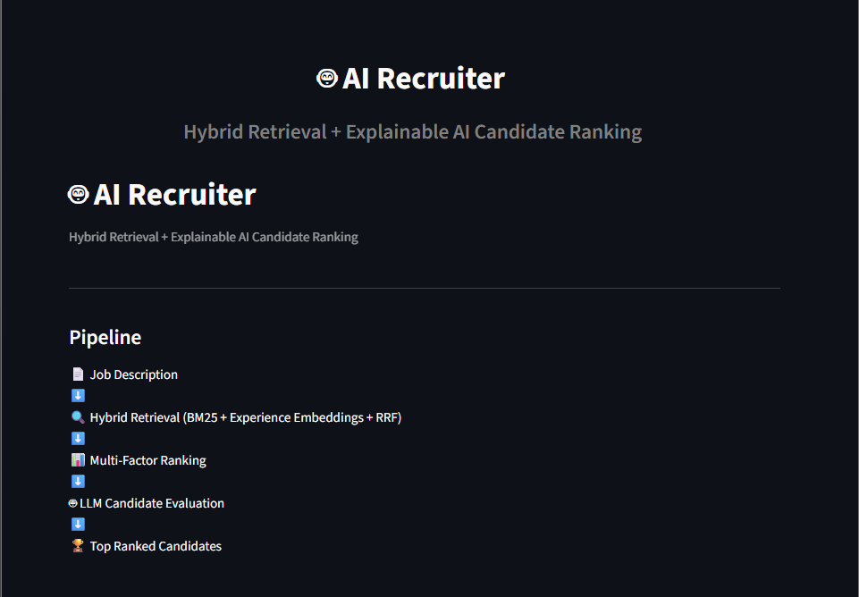
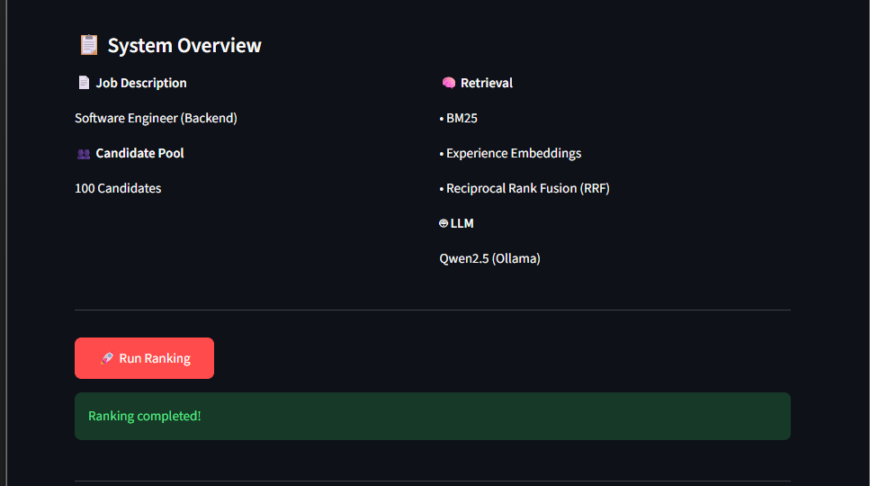
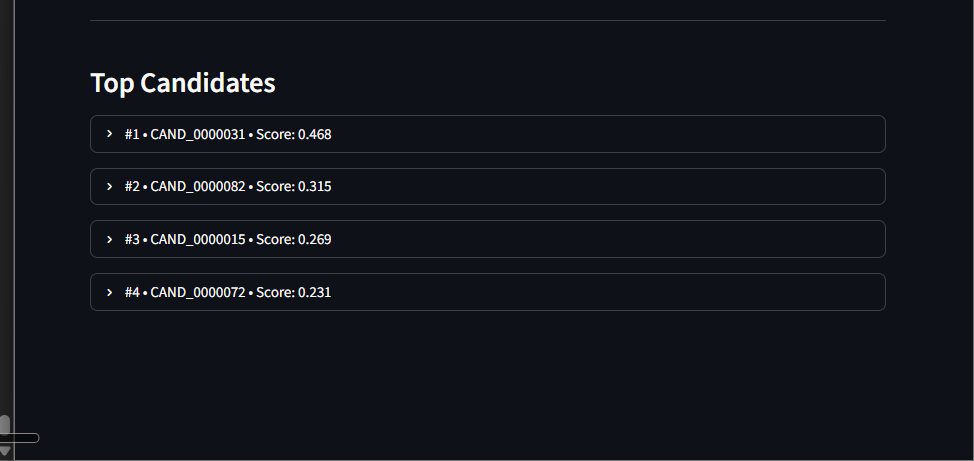
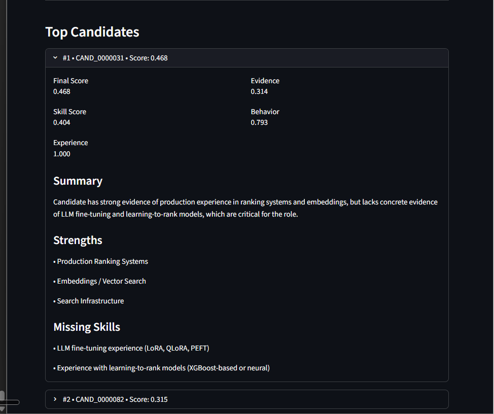

# 🤖 AI Recruiter

An AI-powered candidate ranking system that intelligently matches resumes against a job description using **Hybrid Retrieval**, **Multi-Factor Ranking**, and **LLM-based Explainable AI**.

Built for the **India Runs Hackathon – Data & AI Challenge**.

---
# 📸 Application Preview

### 🏠 Home Dashboard

> Overview of the AI Recruiter dashboard before running the pipeline.

<p align="center">
  
</p>

---

### ⚡ Running the Ranking Pipeline

> Candidate ranking in progress using Hybrid Retrieval and LLM evaluation.

<p align="center">
  
</p>

---

### 🏆 Top Ranked Candidates

> Final ranked candidates with explainable AI analysis.

<p align="center">
  
</p>

---

### 📄 Candidate Details

> Expandable candidate card showing strengths, missing skills, scores, and AI-generated summary.

<p align="center">
  
</p>

---

## ✨ Features

- 📄 Parses a Job Description from a DOCX file
- 🔍 Hybrid Candidate Retrieval
  - BM25 Keyword Search
  - Semantic Experience Embeddings
  - Reciprocal Rank Fusion (RRF)
- 📊 Multi-Factor Candidate Ranking
  - Skill Match
  - Experience Match
  - Evidence Score
  - Behavioral Signals
- 🤖 LLM-powered Candidate Evaluation
  - Candidate Summary
  - Strengths
  - Missing Skills
  - Hiring Recommendation
- 🖥️ Interactive Streamlit Dashboard

---

## 🏗️ System Architecture

```
                Job Description
                      │
                      ▼
          Requirement Extraction
                      │
                      ▼
             Hybrid Retrieval
        ┌─────────────────────────┐
        │ • BM25                  │
        │ • Experience Embeddings │
        │ • Reciprocal Rank Fusion│
        └─────────────────────────┘
                      │
                      ▼
            Top Candidate Pool
                      │
                      ▼
          Multi-Factor Ranking
      ┌───────────────────────────┐
      │ • Skill Score             │
      │ • Experience Score        │
      │ • Evidence Score          │
      │ • Behavioral Signals      │
      └───────────────────────────┘
                      │
                      ▼
           LLM Candidate Analysis
                      │
                      ▼
              Ranked Candidates
```

---

## 🛠 Tech Stack

### AI / Machine Learning

- Sentence Transformers
- all-MiniLM-L6-v2
- Ollama
- Qwen2.5

### Retrieval

- BM25
- Dense Embeddings
- Reciprocal Rank Fusion (RRF)

### Backend

- Python
- Pydantic

### Frontend

- Streamlit

### Data Processing

- python-docx
- JSONL

---

## 📂 Project Structure

```
AI-Recruiter/
│
├── data/
│   └── candidates.jsonl
│
├── India_Runs_Hackathon/
│   └── job_description.docx
│
├── src/
│   ├── app.py
│   ├── pipeline.py
│   ├── retrieval.py
│   ├── ranking.py
│   ├── job_representation.py
│   ├── data_loader.py
│   └── ...
│
├── requirements.txt
└── README.md
```

---

## 🚀 Getting Started

### 1. Clone the repository

```bash
git clone https://github.com/<your-username>/AI-Recruiter.git

cd AI-Recruiter
```

---

### 2. Create Virtual Environment

```bash
python -m venv .venv
```

Activate

Windows

```bash
.venv\Scripts\activate
```

Linux / Mac

```bash
source .venv/bin/activate
```

---

### 3. Install Dependencies

```bash
pip install -r requirements.txt
```

---

### 4. Start Ollama

```bash
ollama serve
```

Pull the model

```bash
ollama pull qwen2.5:3b
```

---

### 5. Run the Streamlit App

```bash
python -m streamlit run src/app.py
```

---
## 💡 Future Improvements

- Dynamic Job Description Upload
- Resume PDF Parsing
- Interactive Filtering
- Candidate Comparison View
- REST API Deployment
- Docker Support
- Vector Database Integration

---

## 👩‍💻 Author

**Khubi Sahu**

- GitHub: https://github.com/khubi07
- LinkedIn: *(Add your LinkedIn URL here)*

---

## ⭐ If you found this project interesting, consider giving it a star!